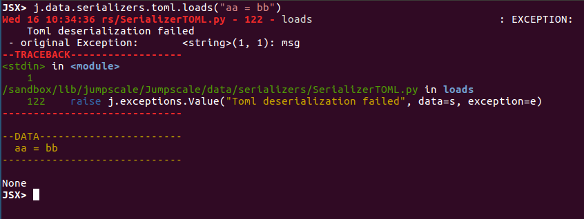

# Shell
Kosmos shell is based on [ptpython](https://github.com/prompt-toolkit/ptpython), which is a python REPL with many good features, it uses [prompt-toolkit](https://github.com/prompt-toolkit/ptpython) for the interface.

To enter the shell, just execute `kosmos`, you will find `j` object available directly too, with auto-completion, logging, error handling and more.


### Content

- [Command line options](#command-line-options)
- [Key bindings](#key-bindings)
- [Text selection](#text-selection)
- [Auto-completion](#auto-completion)
- [Logging](#logging)
- [Exceptions](#exceptions-and-debugging)
- [Running instructions directly](#running-instructions-or-scripts-directly)
- [Known issues](#known-issues)
- [Internals](#internals)


## Command line options
`kosmos` command have some useful options, they can be listed by passing `-h`:

```
3BOTDEVEL:3bot:~: kosmos -h
usage: kosmos [-h] [-q] [-r] [--instruct INSTRUCT] [--ignore_error] [--debug]
              [--logging-panel-lines LOGGING_PANEL_LINES] [-p]

optional arguments:
  -h, --help            show this help message and exit
  -q, --quiet           Turn off debug mode and logging
  -r, --reset           Reset system BCDB and all encryption keys (DANGEROUS)
  --instruct INSTRUCT   if you want to instruct kosmos to execute instructions
                        see documentation kosmos_instruct.md .
  --ignore_error        will continue instructions even if error
  --debug               will go in debug session when error
  --logging-panel-lines LOGGING_PANEL_LINES
                        set the line count for logging panel (0 means
                        disabled), default: -1 (auto)
  -p, --patch           Monkeypatch the system for gevent

```

## Key bindings
Inside the shell, we added some custom key bindings:

- `Control + J`: Debug the current statement or run pudb in post-mortem mode in case of any exceptions.
- `?`: To get the docstring of the function or property
- `Control + P`: Show or hide logging pane


## Text selection
In case of text selection, it depends on the mode (F2 to show the menu), by default `Shift` key is needed for text selection, copy...etc

## Auto-completion
Auto completions is supported for jumpscale objects, if the object is a jumpscale object, it'd have 3 different colors for completions:

- `Red`: methods
- `Yellow`: for properties
- `green`: saved config


## Logging
There's a custom logging pane added to the bottom of the window, this will prevent printing the logs while typing and doing auto-completions.


You change the number of lines shown by (can be disabled too) when running `kosmos`:

- `kosmos --logging-panel-lines 0`: will disable logging panel (can be spammy, as errors will be logged to it too)
- `kosmos --logging-panel-lines 5`: will change the lines shown to 5

**Note** that option value will be saved and used in upcoming shell sessions.

## Exceptions and debugging

Exceptions is printed in a way that make it easy debug and inspect.



For deugging, you can jump into the debugger (`pudb` by default) by pressing `Control + J` after writing the statement or after an exception (post-mortem).

## Running instructions or scripts directly

A useful feature where you need to run a statement or a command directly with kosmos shell, this'd help debugging or printing all the logs to standard output instead.

You can do so by simply passing the instruction or script path to kosmos:


`kosmos -p "j.servers.myjobs.workers_tmux_start()"`

**Note** _-p_ here for gevent monkey patching.


Or create a script:

```python
# start_jq.py
from Jumpscale import j

j.servers.myjobs.workers_tmux_start()
```

Then run it:

`kosmos -p start_jq.py`

## Known issues
* Using any debugger that's based on prompt-toolkit (like `ipdb`) will cause some [concurrency problems](https://github.com/threefoldtech/jumpscaleX_core/issues/49#issuecomment-530411221), as prompt-toolkit only allow one running app, as a solution you can use `pudb` or try running the [instuction directly](#running-instructions-or-scripts-directly), not from a shell session.
* Logs overwrite debugger interface. To solve this problem, try using `j.debug()` for break points, it will stop logging while debugging, also setting `debug=False` in jumpscale configuratio would help as `debug` forces writing logs.
## Internals

You'll find [here](shell_internals.md) a list of internal details about the shell.
